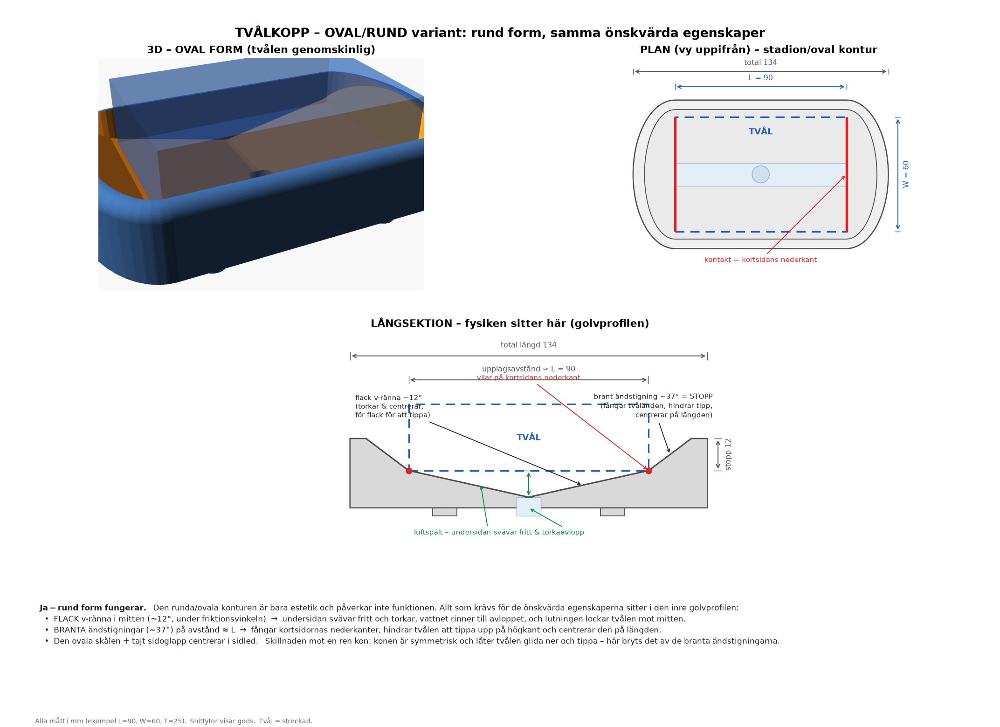
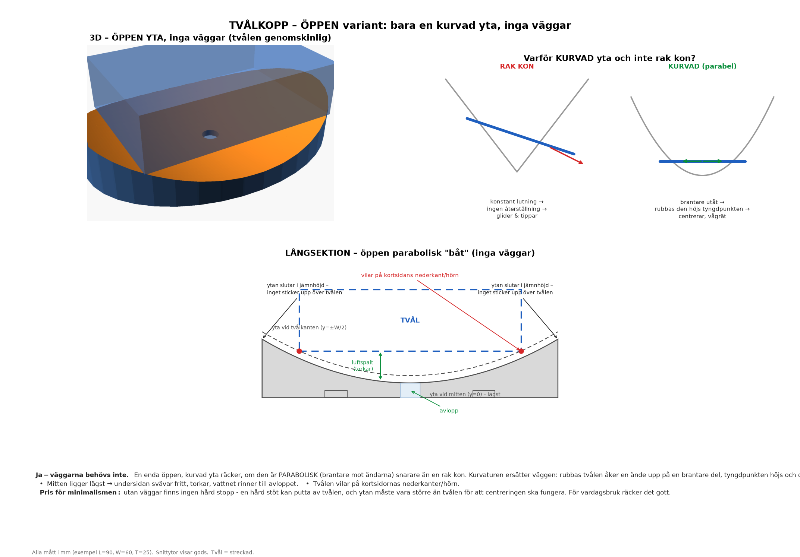
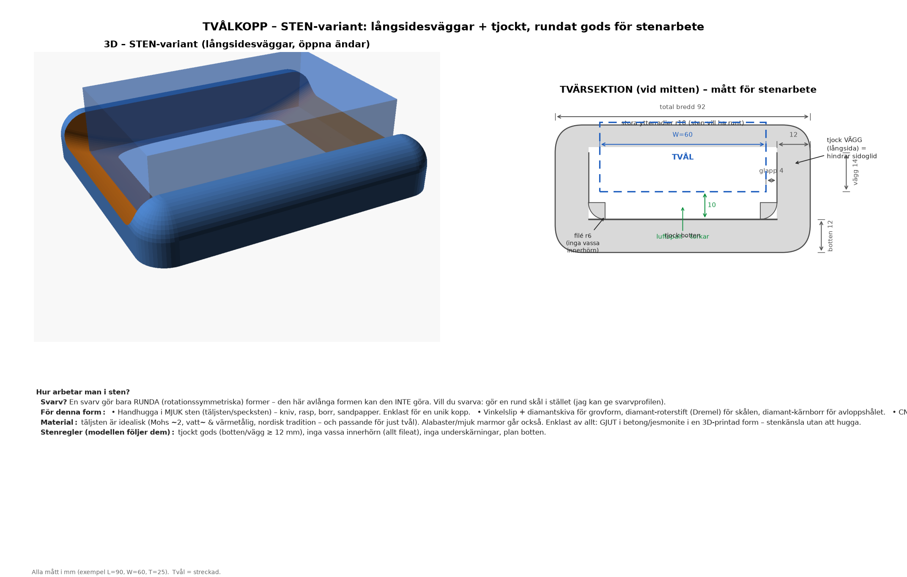
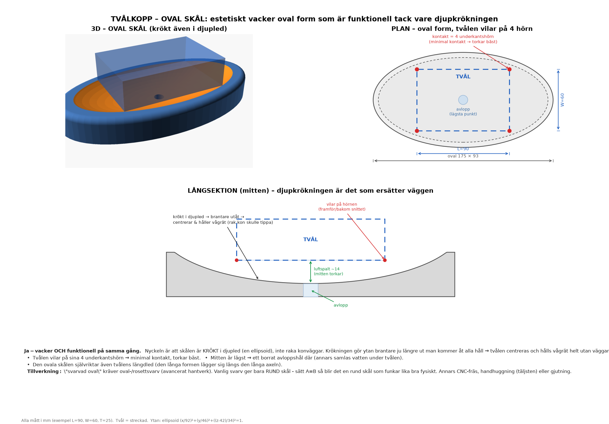
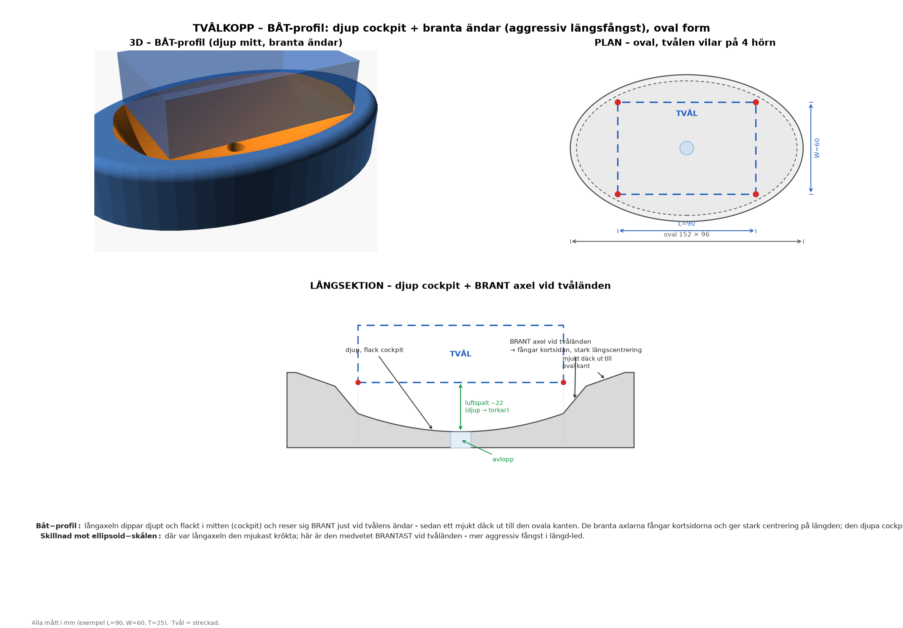
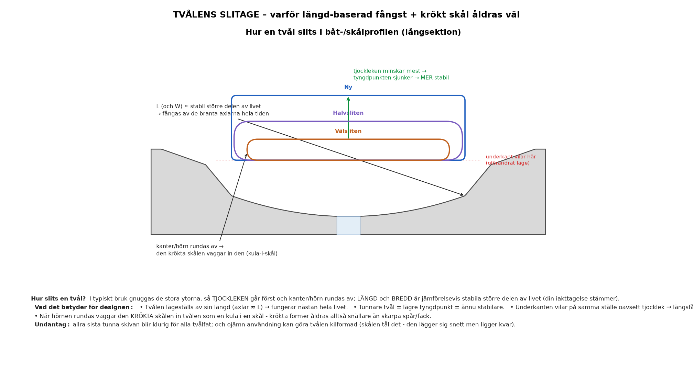
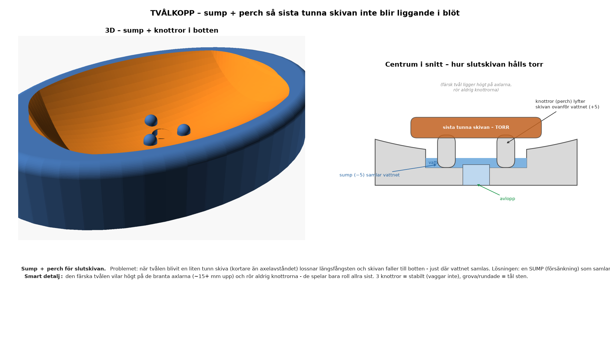

# Tvålkopp – självcentrerande, tvålen vilar vågrätt på kortsidornas nederkanter

Tvålen ses som ett **rätblock**: `L` = långsida, `W` = kortsida, `T` = tjocklek.

Målet: tvålen ska ligga **vågrätt** och vila på **kortsidornas båda nederkanter**,
så att hela undersidan svävar fritt och torkar (utom de smala kontaktlinjerna).
Och – det svåra – den ska hitta sitt **jämviktsläge av sig själv** när man bara
släpper ner den.


3D-modell (tvålen genomskinlig, vilande på kortsidornas nederkanter):


---

## Varför en *ren kon* inte fungerar

Detta är själva kruxet, och din magkänsla att "det blir ett stort problem" stämmer.

I en kon (eller tratt) kan tvålen **sänka sin tyngdpunkt genom att tippa** upp på
ena änden: den nedre änden glider in mot spetsen och blir lägre. Räknar man på en
stav som vilar mot konväggarna blir tyngdpunktens höjd

```
h  ∝  √(L² − d²)
```

där `d` är hur snett den ligger. Höjden är **störst när `d = 0`**, dvs. när tvålen
ligger vågrätt. Vågrätt är alltså det läge som har **mest** lägesenergi → det är
*instabilt*. En ren kon vill därför **resa tvålen på högkant**, inte hålla den platt.

Slutsats: en konformad grop gör precis tvärtom mot vad du vill.

---

## Lösningen – tre egenskaper

I stället för en kon använder vi en avlång form som gör tvärtom. Tre saker krävs:

1. **Två branta ändväggar**, med inbördes avstånd ≈ `L`.
   För att tvålen ska tippa eller glida på längden måste en ände *klättra uppför*
   en brant vägg → tyngdpunkten höjs → den faller tillbaka. Väggarna **stoppar
   tippningen** och **centrerar tvålen på längden**.

2. **Flack v-ränna i mitten** (lutning ≲ 12°, dvs. under friktionsvinkeln för blöt
   tvål mot plast/keramik). Tvålens undersida **svävar fritt** över rännan och
   torkar, och vattnet rinner ner till mitten och vidare ut genom **avloppshålet**
   i stället för att samlas i en pöl under tvålen. Den flacka lutningen gör också
   att tvålen glider ner mot mitten när man släpper den, men är för flack för att
   den ska kunna tippa.

3. **Svag tvärlutning + låga sidoräcken.**
   Centrerar tvålen i sidled och hindrar den från att rulla.

Resultat: släpp tvålen *ungefär* rätt i koppen, så glider den ner till ett
vågrätt jämviktsläge och vilar på kortsidornas nederkanter. Endast två smala
linjer är i kontakt – resten av undersidan torkar.

---

## Kontakt och torkning

```
        kortsidans nederkant                      kortsidans nederkant
              │                                          │
   ███████████▼██████████  TVÅL (vågrät)  █████████████▼█████████
              ●                                          ●        ← enda kontakten
             ╱ ╲______________ luftspalt ______________╱ ╲       (två linjer, längd W)
   brant    ╱   ╲____________ (undersidan torkar) ____╱   ╲   brant
   vägg ───╱     ╲__________ vatten rinner till ____╱      ╲─── vägg
                            avlopp i mitten
```

---

## Mått (parametriska – ändra fritt)

Exemplet i ritningen utgår från en vanlig tvålbit:

| Storhet | Symbol | Exempel |
|---|---|---|
| Långsida | `L` | 90 mm |
| Kortsida | `W` | 60 mm |
| Tjocklek | `T` | 25 mm |
| Upplagsavstånd (≈ ändväggarnas insidor) | `L` | 90 mm |
| Luftspalt under mitten | `gap` | 10 mm |
| Stopphöjd (vägg över viloläget) | `stop` | 12 mm |
| Total (L×B×H) | | ≈ 116 × 76 × 26 mm |

**Tumregler om du skalar:**
- Rännans lutning bör vara **flack** (~10–12°). Brantare → risk att tvålen tippar;
  flackare → den centrerar sämre när man släpper den.
- Ändväggarna ska vara **branta** (≳ 40°) och minst ~`stop` höga – de gör jobbet
  med att stoppa tippningen.
- En tvål **krymper** när den används. Gör `gap` lite tilltagen så att även en
  tunnare/kortare tvål fortfarande vilar mellan väggarna (den lägger sig då bara
  en aning längre ner mot mitten – fortfarande vågrätt).

---

## Rund/oval variant ("avlångt cirkulär")

Gillar du runda former? Det går utmärkt – **den runda konturen är bara estetik
och påverkar inte funktionen.** Allt som krävs för de önskvärda egenskaperna
sitter i den inre **golvprofilen**, inte i ytterkonturen:

- **flack v-ränna i mitten** (~12°) → undersidan svävar fritt och torkar, vattnet
  rinner till avloppet, och lutningen lockar tvålen mot mitten;
- **branta ändstigningar** (~37°) på avstånd ≈ `L` → fångar kortsidornas
  nederkanter, hindrar tippning och centrerar på längden;
- **oval skål + tajt sidoglapp** → centrerar i sidled.

Skillnaden mot en ren kon: konen är symmetrisk och låter tvålen glida ner och
tippa – här bryts det av de branta ändstigningarna. Ytterformen är en
"stadion/oval" (rundade ändar), allt mjukt rundat.



---

## Öppen variant – bara en kurvad yta, inga väggar

Måste vi ha väggar? **Nej.** En enda öppen, kurvad yta räcker – men den måste
vara **parabolisk** (brantare mot ändarna), *inte* en rak kon:

- En **rak kon** har konstant lutning → ingen återställande kraft → tvålen
  glider ner och tippar (samma fel som tidigare, fast utan vägg som stoppar).
- En **parabolisk ("båt"-formad) yta** blir brantare ju längre ut man kommer →
  rubbas tvålen åker en ände upp på en brantare del → tyngdpunkten höjs → den
  glider tillbaka. **Kurvaturen ersätter väggen.**

Mitten ligger lägst (undersidan torkar, vattnet rinner till avloppet) och tvålen
vilar på kortsidornas nederkanter/hörn. Priset för minimalismen: ingen hård
stopp (en hård stöt kan putta av tvålen), och ytan måste vara större än tvålen
för att centreringen ska fungera.



---

## Variant med långsidesväggar (gjord för sten)

Vill man att tvålen inte ska kunna glida av i sidled lägger man till **väggar på
långsidorna**. Den paraboliska golvprofilen sköter centreringen på längden;
långsidesväggarna ger en hård sidostopp. Kortändarna hålls låga/öppna så att man
kan skjuta ut tvålen och vattnet rinner av.

Den här varianten är ritad för att kunna **göras i sten**: tjockt gods
(botten/vägg ≳ 12 mm), inga vassa innerhörn (allt fileat), inga underskärningar
och plan botten.



### Hur arbetar man i sten? (och: svarv?)

- **Svarv** gör bara **runda** (rotationssymmetriska) former. Den här avlånga
  formen kan en svarv **inte** göra. Vill du svarva: gör i stället en **rund
  skål** (säg till så ger jag svarvprofilen – en parabolisk/sfärisk urgröpning
  som tvålen vilar i).
- **Handhuggning i mjuk sten** (täljsten/specksten, Mohs ~2): kniv, rasp,
  filar/rifflers, borr, och sandpapper/diamantsvampar till finish. Enklast för
  en unik kopp – täljsten kan i stort sett bearbetas med träverktyg.
- **Vinkelslip + diamantskiva** för grovform, **diamant-roterstift (Dremel)**
  för skålen, **diamant-kärnborr** för avloppshålet.
- **CNC-stenfräs** med diamantverktyg (vattenkyld) för exakt form eller hård
  sten (granit). Mata in STL:en från `tvalkopp_sten.scad`.
- **Vattenskärning** kan grovkapa planformen ur en skiva (sedan urgröpning för
  hand/CNC).

**Material:** täljsten är idealisk – mjuk, vatten- och värmetålig, nordisk
tradition, och passande tema för just tvål. Alabaster eller mjuk marmor går
också. Enklast av allt: **gjut** i betong/jesmonite i en 3D-printad form –
stenkänsla utan att hugga.

---

## Oval skål – vacker form, funktionell tack vare djupkrökningen

En **oval skål som är krökt även i djupled** (en ellipsoid-skål) ger både en
estetiskt vacker form *och* full funktion – samtidigt. Det är just
**djupkrökningen** som är poängen:

- En **rak kon** har konstant lutning → ingen återställning → tvålen tippar.
- En **krökt skål** (ellipsoid) blir brantare ju längre ut man kommer åt alla
  håll → tvålen centreras och hålls vågrät **helt utan väggar**.

Tvålen vilar på sina **4 underkantshörn** (minimal kontakt → torkar bäst),
mitten svävar fritt, och den ovala formen självriktar även tvålens längdled.
Mitten är lägsta punkten → ett **borrat avloppshål** där (annars samlas vatten
under tvålen).

**Tillverkning:** "svarvad oval" kräver **oval-/rosettsvarv** (avancerat
hantverk). En vanlig svarv ger bara **rund** skål – sätt `A=B` i modellen så
blir det en rund skål som funkar lika bra fysiskt. Annars CNC-fräs,
handhuggning (täljsten) eller gjutning.



---

## Båt-profil – djup cockpit + branta ändar (aggressiv längsfångst)

Om man vill att djupet ska vara **mer aggressivt i längd-led** byter man från
ellipsoid till en **båt-profil**: långaxeln dippar djupt och flackt i mitten
(cockpit) och reser sig **brant just vid tvålens ändar** (axlar/"shoulders"),
och planar sedan ut i ett mjukt däck ut till den ovala kanten.

- De **branta axlarna** fångar kortsidorna → stark centrering på längden.
- Den **djupa cockpiten** gör att undersidan svävar fritt och torkar (avlopp i
  lägsta punkten).
- **Tvärsnittet** är en flack parabel som når samma rimhöjd överallt → ren oval
  kant och mild sidocentrering.

Skillnad mot ellipsoid-skålen: där var långaxeln den *mjukast* krökta; här är
den medvetet *brantast* vid tvåländen. Justera `cdip` (cockpit-djup), `Sh`
(axelns höjd) och `xsh_ex` (axelns längd – kort = brantare) för mer/mindre
aggressiv fångst.



---

## Not: tvålens slitage

En tvål slits inte jämnt: man gnuggar de stora ytorna, så **tjockleken (T) går
först** och **kanter/hörn rundas av**, medan **längd (L) och bredd (W) är
jämförelsevis stabila** större delen av livet. Det är gynnsamt för dessa
designer:

- Tvålen **lägeställs av sin längd** (axlar/väggar ≈ L) → fungerar nästan hela
  livet.
- **Tunnare tvål = lägre tyngdpunkt = ännu stabilare.**
- Underkanten vilar på samma ställe oavsett tjocklek → längsfångsten påverkas
  inte.
- När hörnen rundas **vaggar den krökta skålen in tvålen** (kula-i-skål) →
  krökta former åldras snällare än skarpa spår/fack.

Undantag: den allra sista tunna skivan blir klurig för alla tvålfat, och ojämn
användning kan göra tvålen kilformad (skålen tål det – den lägger sig snett men
ligger kvar).



---

## Sump + perch för slutskivan

När tvålen blivit en liten tunn skiva (kortare än axelavståndet) lossnar
längsfångsten och skivan faller till botten – just där vattnet samlas. Båt-
modellen (`tvalkopp_bat.scad`, `sump=true`) löser det med:

- en **sump** (försänkning) i botten som samlar vattnet och leder det till
  avloppet, och
- tre små rundade **knottror** (perch) som skivan vilar på en bit *ovanför*
  vattnet → den hålls torr och mosas inte.

Den färska tvålen ligger högt på de branta axlarna (~15 mm upp) och rör aldrig
knottrorna – de spelar bara roll allra sist. Tre knottror = stabilt (vaggar
inte), grova och rundade = tål sten. Styrs av `sump_d`, `nub_above`, `nub_r`,
`peg_d`. (`show_sliver=true` visar slutskivan på knottrorna.)



---

## Filer

| Fil | Beskrivning |
|---|---|
| `tvalkopp_ritning.png` | Rektangulär variant: ortografiska vyer + 3D + förklaring |
| `tvalkopp_3d.png` | 3D-render av den rektangulära modellen |
| `tvalkopp_oval_ritning.png` | **Oval/rund** variant: 3D + plan + långsektion + förklaring |
| `oval_iso.png` | 3D-render av den ovala modellen |
| `tvalkopp_oppen_ritning.png` | **Öppen** variant (inga väggar): 3D + kon-vs-kurva + långsektion |
| `oppen_iso.png` | 3D-render av den öppna modellen |
| `tvalkopp_sten_ritning.png` | **Sten**-variant: 3D + måttsatt tvärsektion + sten-guide |
| `sten_iso.png` | 3D-render av sten-varianten |
| `tvalkopp_ovalskal_ritning.png` | **Oval skål**: 3D + plan + långsektion + förklaring |
| `ovalskal_iso.png` | 3D-render av oval skål-varianten |
| `tvalkopp_bat_ritning.png` | **Båt-profil**: 3D + plan + långsektion + förklaring |
| `bat_iso.png` | 3D-render av båt-profil-varianten |
| `tvalkopp_slitage.png` | Illustration: hur tvålen slits och varför designen åldras väl |
| `tvalkopp_sump_ritning.png` | **Sump + perch**: hur sista tunna skivan hålls torr |
| `bat_sump_iso.png` | 3D-render av båt med sump + knottror |
| `rita_tvalkopp.py` | Genererar rektangulära ritningen (matplotlib) |
| `rita_tvalkopp_oval.py` | Genererar ovala ritningen (matplotlib) |
| `rita_tvalkopp_oppen.py` | Genererar öppna ritningen (matplotlib) |
| `rita_tvalkopp_sten.py` | Genererar sten-ritningen (matplotlib) |
| `rita_tvalkopp_ovalskal.py` | Genererar oval skål-ritningen (matplotlib) |
| `rita_tvalkopp_bat.py` | Genererar båt-profil-ritningen (matplotlib) |
| `rita_tvalkopp_slitage.py` | Genererar slitage-illustrationen (matplotlib) |
| `rita_tvalkopp_sump.py` | Genererar sump-ritningen (matplotlib) |
| `tvalkopp.scad` | Parametrisk rektangulär modell (OpenSCAD → STL) |
| `tvalkopp_oval.scad` | Parametrisk **oval/rund** modell (OpenSCAD → STL) |
| `tvalkopp_oppen.scad` | Parametrisk **öppen** modell utan väggar (OpenSCAD → STL) |
| `tvalkopp_sten.scad` | Parametrisk **sten**-modell med långsidesväggar (OpenSCAD → STL) |
| `tvalkopp_ovalskal.scad` | Parametrisk **oval skål** (ellipsoid, krökt i djupled; A=B → rund) |
| `tvalkopp_bat.scad` | Parametrisk **båt-profil** (djup cockpit + branta ändar) |

### Återskapa ritningarna
```bash
pip install matplotlib numpy
python3 rita_tvalkopp.py        # -> tvalkopp_ritning.png  (rektangulär)
python3 rita_tvalkopp_oval.py   # -> tvalkopp_oval_ritning.png  (oval; kräver oval_iso.png)
```

### 3D-modell / utskrift
Öppna `tvalkopp.scad` eller `tvalkopp_oval.scad` i
[OpenSCAD](https://openscad.org), ändra `L`, `W`, `T`, tryck **F6** och exportera
**STL**. Sätt `show_soap = false` före export. Den ovala modellen har även
`cut = true` för att se golvprofilen i längssnitt. Skriv ut i fukttålig plast
(t.ex. PETG) eller gjut i keramik/betong.

Rendera bilder från kommandoraden (headless):
```bash
openscad -o oval_iso.png --imgsize=1400,1000 \
  --camera=0,0,5,60,0,335,215 --colorscheme=Tomorrow tvalkopp_oval.scad
```
