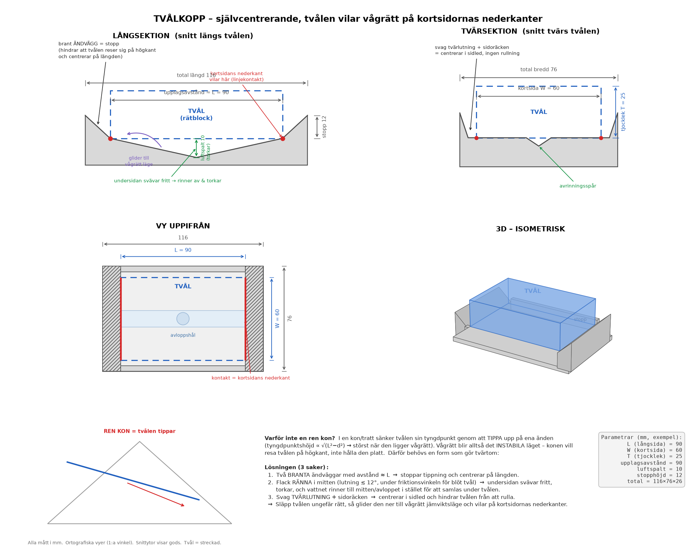
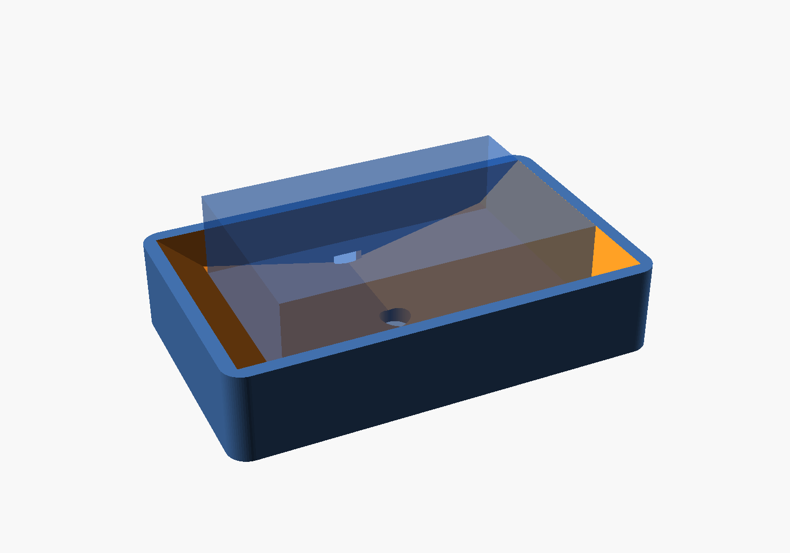

# Tvålkopp – självcentrerande, tvålen vilar vågrätt på kortsidornas nederkanter

Tvålen ses som ett **rätblock**: `L` = långsida, `W` = kortsida, `T` = tjocklek.

Målet: tvålen ska ligga **vågrätt** och vila på **kortsidornas båda nederkanter**,
så att hela undersidan svävar fritt och torkar (utom de smala kontaktlinjerna).
Och – det svåra – den ska hitta sitt **jämviktsläge av sig själv** när man bara
släpper ner den.



3D-modell (tvålen genomskinlig, vilande på kortsidornas nederkanter):



---

## Varför en *ren kon* inte fungerar

Detta är själva kruxet, och din magkänsla att "det blir ett stort problem" stämmer.

I en kon (eller tratt) kan tvålen **sänka sin tyngdpunkt genom att tippa** upp på
ena änden: den nedre änden glider in mot spetsen och blir lägre. Räknar man på en
stav som vilar mot konväggarna blir tyngdpunktens höjd

```
h  ∝  √(L² − d²)
```

där `d` är hur snett den ligger. Höjden är **störst när `d = 0`**, dvs. när tvålen
ligger vågrätt. Vågrätt är alltså det läge som har **mest** lägesenergi → det är
*instabilt*. En ren kon vill därför **resa tvålen på högkant**, inte hålla den platt.

Slutsats: en konformad grop gör precis tvärtom mot vad du vill.

---

## Lösningen – tre egenskaper

I stället för en kon använder vi en avlång form som gör tvärtom. Tre saker krävs:

1. **Två branta ändväggar**, med inbördes avstånd ≈ `L`.
   För att tvålen ska tippa eller glida på längden måste en ände *klättra uppför*
   en brant vägg → tyngdpunkten höjs → den faller tillbaka. Väggarna **stoppar
   tippningen** och **centrerar tvålen på längden**.

2. **Flack v-ränna i mitten** (lutning ≲ 12°, dvs. under friktionsvinkeln för blöt
   tvål mot plast/keramik). Tvålens undersida **svävar fritt** över rännan och
   torkar, och vattnet rinner ner till mitten och vidare ut genom **avloppshålet**
   i stället för att samlas i en pöl under tvålen. Den flacka lutningen gör också
   att tvålen glider ner mot mitten när man släpper den, men är för flack för att
   den ska kunna tippa.

3. **Svag tvärlutning + låga sidoräcken.**
   Centrerar tvålen i sidled och hindrar den från att rulla.

Resultat: släpp tvålen *ungefär* rätt i koppen, så glider den ner till ett
vågrätt jämviktsläge och vilar på kortsidornas nederkanter. Endast två smala
linjer är i kontakt – resten av undersidan torkar.

---

## Kontakt och torkning

```
        kortsidans nederkant                      kortsidans nederkant
              │                                          │
   ███████████▼██████████  TVÅL (vågrät)  █████████████▼█████████
              ●                                          ●        ← enda kontakten
             ╱ ╲______________ luftspalt ______________╱ ╲       (två linjer, längd W)
   brant    ╱   ╲____________ (undersidan torkar) ____╱   ╲   brant
   vägg ───╱     ╲__________ vatten rinner till ____╱      ╲─── vägg
                            avlopp i mitten
```

---

## Mått (parametriska – ändra fritt)

Exemplet i ritningen utgår från en vanlig tvålbit:

| Storhet | Symbol | Exempel |
|---|---|---|
| Långsida | `L` | 90 mm |
| Kortsida | `W` | 60 mm |
| Tjocklek | `T` | 25 mm |
| Upplagsavstånd (≈ ändväggarnas insidor) | `L` | 90 mm |
| Luftspalt under mitten | `gap` | 10 mm |
| Stopphöjd (vägg över viloläget) | `stop` | 12 mm |
| Total (L×B×H) | | ≈ 116 × 76 × 26 mm |

**Tumregler om du skalar:**
- Rännans lutning bör vara **flack** (~10–12°). Brantare → risk att tvålen tippar;
  flackare → den centrerar sämre när man släpper den.
- Ändväggarna ska vara **branta** (≳ 40°) och minst ~`stop` höga – de gör jobbet
  med att stoppa tippningen.
- En tvål **krymper** när den används. Gör `gap` lite tilltagen så att även en
  tunnare/kortare tvål fortfarande vilar mellan väggarna (den lägger sig då bara
  en aning längre ner mot mitten – fortfarande vågrätt).

---

## Filer

| Fil | Beskrivning |
|---|---|
| `tvalkopp_ritning.png` | Ortografiska vyer (långsektion, tvärsektion, vy uppifrån) + 3D + förklaring |
| `tvalkopp_3d.png` | 3D-render av den parametriska modellen |
| `rita_tvalkopp.py` | Genererar ritningen (matplotlib). Ändra `L, W, T` överst. |
| `tvalkopp.scad` | Parametrisk 3D-modell för OpenSCAD → STL för 3D-utskrift |

### Återskapa ritningen
```bash
pip install matplotlib numpy
python3 rita_tvalkopp.py        # -> tvalkopp_ritning.png
```

### 3D-modell / utskrift
Öppna `tvalkopp.scad` i [OpenSCAD](https://openscad.org), ändra `L`, `W`, `T`,
tryck **F6** för att rendera och exportera **STL**. Sätt `show_soap = false`
innan du exporterar för utskrift. Skriv ut i fukttålig plast (t.ex. PETG) eller
gjut i keramik/betong.
